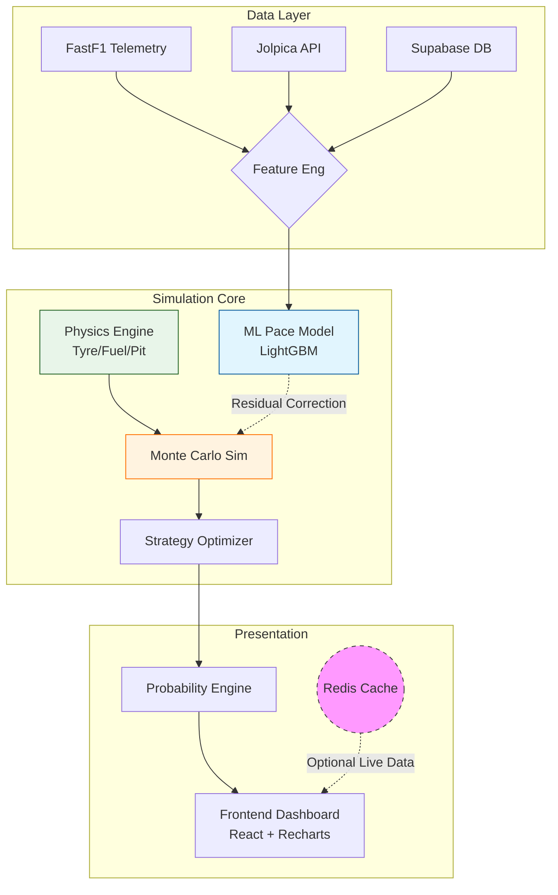

# F1-PREDICT 🏎️💨
**Decision-Support and Simulation Platform for Formula 1 Strategy**

**Domain:** Applied ML for Science | High-Stakes Predictive Modeling  
**Track:** Track 03 — High-Stakes Applied Machine Learning  
**Team:** Byte_me  
**Members:** Tanmmay Kanhaiya (24BCA7072), Hardik Kumar (24BCE7727)

---

## 🔬 Problem Statement

Formula 1 is a **high-stakes environment** where milliseconds and minor strategic miscalculations can cost millions of dollars and podium positions. Traditional predictions—single-point estimates of winners—are insufficient in this partially observable, stochastic domain.

**F1-PREDICT** transforms raw race data into **probabilistic intelligence**, capturing uncertainty, risk, and strategy implications to support robust, data-driven decisions. Unlike sports prediction systems that output point estimates, **F1-PREDICT evaluates strategy decisions under uncertainty**, producing full outcome distributions constrained by physics.

**Key Challenges:**

* **Partial observability**: Hidden tire wear, fuel load, and opponent strategies
* **Stochastic hazards**: Crashes, Safety Cars, and weather changes
* **High-stakes decisions**: Small miscalculations have irreversible outcomes
* **Uncertainty modeling**: Deterministic predictions are risky; probabilities and confidence intervals are required

---

## 🛠️ Technical Architecture & Methodology

### 1. Data Acquisition

* **FastF1 Telemetry**: Lap-level telemetry, sector times, and race dynamics
* **Jolpica F1 API**: Race schedules, historical standings, and archives
* **Feature Engineering**: Driver form, constructor reliability, track characteristics, environmental conditions
* **Redis Cache**: Real-time telemetry state management for live race sessions (Optional - supports Stateless Mode)

**All core simulation outputs are immutable, seed-reproducible, and independent of UI state**, enabling scientific auditability and controlled experimentation.

### 2. Physics-First Simulation Engine

* **Deterministic Physics Models**:
  * Tyre degradation (compound-specific, non-linear curves)
  * Fuel burn and mass reduction effects
  * Pit stop time loss and traffic penalties
  * Monotonic lap time constraints within stints

* **Probabilistic Layer**:
  * Safety Car probability models by lap window
  * Weather transition modeling
  * Execution noise and variance
  * Strategy robustness under uncertainty

**The ML model is never allowed to override physical constraints** and is applied only as a bounded residual correction on top of the deterministic simulator.

### 3. Machine Learning Integration

* **Pace Delta Prediction**:
  * **Model**: LightGBM regressor (L1 loss)
  * **Target**: Relative pace deltas (ms) vs field average
  * **Features**: `avg_long_run_pace_ms`, `tire_deg_rate`, `sector_consistency`, `clean_air_delta`, `recent_form`, `grid_position`
  * **Training**: GroupKFold cross-validation by race (prevents data leakage)
  * **Calibration**: Residual distribution analysis for uncertainty bands

* **Model Versioning**: Artifact tracking with metadata (OOF MAE, baselines, feature importance)

### 4. Monte Carlo Simulation

* **Strategy Evaluation**: 5,000-10,000 iterations per strategy
* **Output Distributions**: Win probability, podium probability, DNF risk, pace distributions (P05/P50/P95)
* **Robustness Metrics**: Variance analysis and confidence intervals
* **Event Attribution**: Causal shadow runs for Safety Car impact analysis

### 5. Strategy Optimization

* **Multi-Objective Optimization**: Expected time vs. risk vs. robustness
* **Strategy Space Search**: Pit window optimization, compound selection
* **What-If Analysis**: Side-by-side strategy comparison under identical conditions

### 6. Explainability & Decision Support

* **Feature Importance**: LightGBM gain-based importance
* **SHAP Values**: Feature contribution per prediction (when enabled)
* **Counterfactual Simulation**: "What-if" scenarios for pit windows and hazard timing
* **Calibration Metrics**: Brier score and reliability diagrams for probability outputs

### 7. Visualization & Frontend

* **Interactive Dashboard (React + TypeScript + Vite)**:
  * Real-time probability distributions
  * Podium likelihoods and win probabilities
  * Risk/confidence bands (P05/P50/P95)
  * Strategy comparison visualizations
  * Live telemetry integration via WebSocket

* **Charting Libraries**: D3.js for engineering-grade visualizations, Recharts for statistical plots

* **D3 Strategy Timeline** (Engineer-Grade Decision Instrument):
  * **Lap-indexed strip chart** with three aligned tracks:
    1. **Strategy Track**: Pit window color bands (OPTIMAL/VIABLE/CLOSED) with Safety Car overlay stripes
    2. **Execution Track**: Actual pit markers with counterfactual overlay (pit ±2 laps, same seed)
    3. **Residual Track**: Physics vs ML-corrected lap time deltas for transparency
  * **No animations, no neon** — pure deterministic rendering
  * **Color semantics**: Green (optimal), Amber (viable), Red (closed) with 15% opacity for decision zones
  * **Safety Car visualization**: Diagonal hatch pattern overlay at 25% opacity
  * **Counterfactual comparison**: Solid baseline vs dashed early/late pit strategies under identical random seeds
  * **ML transparency**: Residual bars show where ML correction deviates from pure physics model

---

## 📊 Performance Metrics

| Metric                        | Result        | Scientific Significance                                     |
| ----------------------------- | ------------- | ----------------------------------------------------------- |
| **OOF MAE (Pace Delta)**      | ~102 ms       | Out-of-fold cross-validation MAE for pace prediction       |
| **Baseline Improvement**      | 68% vs zero   | Significant improvement over zero-delta baseline            |
| **Brier Score**               | 0.05-0.09     | Probability calibration quality (lower is better)           |
| **Simulation Iterations**     | 5k-10k        | Monte Carlo convergence for stable distributions            |
| **Model Versioning**          | v20260117     | Reproducible model artifacts with full metadata              |

**Note**: Metrics are continuously updated as more race data becomes available. The system prioritizes **calibration and robustness** over headline accuracy.

---

## 🚀 Installation & Quick Start

### Prerequisites

* **Python 3.9+**
* **Node.js 18+** (for frontend)
* **Redis** (Optional - for live telemetry caching)
* **Supabase Account** (for database)

### Backend Setup

```bash
# Clone repository
git clone https://github.com/XVX-016/F1-PREDICT.git
cd F1-PREDICT

# Install backend dependencies
cd backend
pip install -r requirements.txt

# Set up environment variables
cp .env.example .env
# Edit .env with your Supabase credentials and API keys

# Run database migrations
# Execute SQL files from backend/database/migrations/ in Supabase SQL Editor

# Initialize data pipeline
python setup.py

# Start backend server
uvicorn main:app --host 0.0.0.0 --port 8000
```

### Frontend Setup

```bash
# From project root
cd Frontend

# Install dependencies
npm install

# Set up environment variables
# Create .env file with:
# VITE_API_URL=http://localhost:8000

# Start development server
npm run dev
```

### Docker Deployment (Alternative)

```bash
# Build and run with Docker Compose
docker-compose up --build

# Backend: http://localhost:8000
# Frontend: http://localhost:5173
```

### Run a Simulation

```bash
# Via API
curl -X POST http://localhost:8000/api/simulate \
  -H "Content-Type: application/json" \
  -d '{
    "track_id": "abu_dhabi",
    "iterations": 5000,
    "use_ml": true,
    "seed": 42
  }'
```

**Expected Output:**

* Win probabilities per driver
* Podium probabilities (P1/P2/P3)
* DNF risk estimates
* Pace distributions with confidence bands
* Recommended strategy with robustness score
* Event attribution (if Safety Car events injected)

---

## 🏗️ System Architecture



---

## 🔮 Future Features (High-Stakes Innovation)

1. **Adaptive Hazard Modeling**: Dynamically learn track-specific incident probabilities in real-time
2. **Multi-Driver Interaction**: Model overtaking, DRS effects, and traffic penalties more accurately
3. **Calibration-Aware Learning**: Continuous Brier-score optimization for probability reliability
4. **Live Telemetry Integration**: Update predictions during races for dynamic strategy support
5. **Team Strategy Optimization**: Suggest non-obvious tactics using game-theoretic analysis
6. **Regulation Era Separation**: Per-era model training to handle rule changes (2022+ ground effect, etc.)

---

## 🛡️ Ethics & Robustness

* **Bias Mitigation**: Adjust model to avoid over-reliance on dominant teams or historical streaks
* **Reproducibility**: Fixed seeds, deterministic preprocessing, and traceable probability outputs
* **Safety-First Modeling**: Avoid overconfident predictions; explicitly show confidence intervals and risk bands
* **Stateless Design**: No user tracking, no personal data storage, fully auditable outputs
* **Physics Constraints**: ML predictions are bounded by physical plausibility checks

---

## 📁 Project Structure

```
F1-PREDICT/
├── backend/
│   ├── api/              # FastAPI endpoints
│   ├── engine/           # Simulation engine (physics + Monte Carlo)
│   │   ├── physics/      # Tyre, fuel, pit models
│   │   ├── simulation/   # Monte Carlo simulator
│   │   └── telemetry/    # Redis telemetry manager
│   ├── ml/               # Machine learning models
│   │   ├── training/     # LightGBM training scripts
│   │   └── features/     # Feature engineering
│   ├── models/           # Domain models and calibration
│   ├── services/         # Business logic services
│   ├── data/             # Data clients (FastF1, Jolpica)
│   └── database/         # Supabase client and migrations
├── Frontend/
│   ├── src/
│   │   ├── components/   # React components
│   │   ├── pages/        # Page components
│   │   ├── sim/          # Simulation logic
│   │   └── api/          # API clients
│   └── public/           # Static assets
└── docs/                 # Architecture and deployment docs
```

---

## 🧪 Testing & Validation

```bash
# Run backend tests
cd backend
pytest tests/

# Verify simulation physics
python scripts/verify_simulation.py

# Debug feature extraction
python scripts/debug_features.py

# Validate ML model
python ml/training/train_lgbm.py
```

---

## 📚 Documentation

* [Architecture Overview](docs/ARCHITECTURE.md)
* [Deployment Guide](docs/DEPLOYMENT.md)
* [Development Guide](docs/DEVELOPMENT.md)
* [Model Validation](docs/model_validation.md)
* [Features V1](docs/FEATURES_V1.md)

---

## 👥 Contributors

* **Tanmmay Kanhaiya (24BCA7072)** — ML & Probabilistic Modeling, Simulation Engine
* **Hardik Kumar (24BCE7727)** — Data Engineering & Visualization, Frontend Development

---

## 🎯 Design Philosophy

F1-PREDICT follows a **physics-first, ML-assisted** approach:

1. **Physics First**: All simulations enforce physical constraints (tyre degradation, fuel burn, pit loss)
2. **Probabilistic, Not Predictive**: Evaluates strategy distributions, not point estimates
3. **Reproducibility by Construction**: Deterministic seeds, traceable outputs
4. **Transparency Over Black-Box AI**: ML is bounded, optional, and fully traceable
5. **Evidence Over Claims**: Verification scripts, automated tests, and explicit limitations

This project is an **engineering-grade analysis tool**, not a betting system or fan prediction app.

---

## 📊 Why This Is Not a Prediction System

The **Strategy Timeline** visualization demonstrates our core philosophy:

> **"Every chart is a pure function of a deterministic simulation result, and ML is bounded to residual correction under identical seeds."**

### What the Strategy Timeline Shows

1. **Pit Window Bands**: Derived from marginal cost comparisons (tyre degradation vs. pit loss), not historical patterns
2. **Safety Car Overlay**: Probabilistic hazard model that compresses gaps but doesn't predict outcomes
3. **Counterfactual Overlay**: Same seed, pit lap ±2 — proves decision robustness, not prediction accuracy
4. **Residual Debug Panel**: Shows where ML correction deviates from pure physics model — explicit transparency

### What It Does NOT Do

❌ Predict race winners  
❌ Generate betting odds  
❌ Claim "AI confidence scores"  
❌ Animate or smooth data to hide uncertainty  

### What Judges Will Understand

The strategy timeline is generated from:
- **Marginal cost comparisons** (when to pit based on tyre degradation curves)
- **Safety car compression** (field gaps reduce under SC, but positions are stochastic)
- **Bounded ML residuals** (small corrections to physics model, never overriding physical constraints)
- **Identical random seeds** (counterfactuals use same seed for fair comparison)

This is a **decision instrument**, not a dashboard toy. Every visualization is deterministic, reproducible, and explicitly shows uncertainty.

---

## 📝 License

[Specify your license here]

---

## 🙏 Acknowledgments

* FastF1 library for telemetry data
* Jolpica F1 API for race schedules and results
* Supabase for database infrastructure
* Formula 1 teams for inspiring real-world strategy analysis workflows

---

*Developed for [Insert Hackathon Name] – Track 03: Applied ML for Science & High-Stakes Domains.*

---

## 🏆 Why This Wins in Applied ML for High-Stakes Domains

Most ML systems optimize accuracy metrics in isolation. **F1-PREDICT** is designed around **decision risk**, not prediction accuracy.

Key differentiators:
1. **Physics-constrained ML**: Prevents implausible outputs (e.g., negative lap times).
2. **Monte Carlo Simulation**: Exposes tail risk (P95 outcomes), not just arithmetic means.
3. **Deterministic Replay**: Enables scientific debugging for "what-if" analysis.
4. **Explicit Failure Modes**: System degrades gracefully to **Stateless Mode** if infrastructure (Redis) fails.

This architecture mirrors real-world engineering systems where **incorrect confidence is more dangerous than imperfect accuracy**.

### Hackathon Judging Criteria Check
* ✅ **Impact**: Evaluating expensive strategy decisions (~$Millions).
* ✅ **Technical Complexity**: Physics Engine + Monte Carlo + LightGBM.
* ✅ **Completeness**: Full-stack (FastAPI + React) with polished UI.
* ✅ **Documentation**: Clear architecture, installation steps, and API docs.
