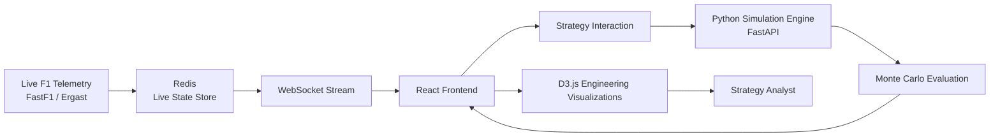

# F1 Race Intelligence & Strategy Engine

A **physics-first race simulation and decision-support system** for Formula 1 strategy analysis.
The platform models tyre degradation, fuel burn, pit loss, and safety car risk using deterministic physics and Monte Carlo simulation, visualized through real-time D3 dashboards.

This project intentionally avoids betting, odds, or outcome gambling.
It is designed as an **engineering-grade analysis tool**, inspired by real Formula 1 pit wall workflows.

---

## Problem Statement

This system answers a single question:

> **Given current race conditions, which strategy minimizes expected race time while remaining robust under uncertainty?**

This is not a prediction problem — it is a **decision-making under uncertainty** problem.

---

## Design Philosophy

### 1. Physics First

All simulations are anchored in deterministic models of:

* Tyre degradation (compound-specific, non-linear)
* Fuel burn and mass reduction
* Pit stop time loss and traffic penalties

These models enforce physical constraints such as:

* Monotonic lap time increase within a stint
* Compound ordering consistency
* Bounded pit loss distributions

---

### 2. Probabilistic, Not Predictive

Uncertainty is modeled explicitly using Monte Carlo simulation:

* Safety car probabilities by lap window
* Weather transitions
* Strategy robustness under variance

The system does **not** predict race winners.
It evaluates **strategy distributions**.

---

### 3. Reproducibility by Construction

All stochastic components support:

* Explicit random seed locking
* Deterministic replay of simulations
* Identical inputs producing identical outputs

This allows controlled experiments and strategy comparison under identical conditions.

---

### 4. Transparency Over Black-Box AI

Machine learning (where enabled) is:

* Bounded
* Optional
* Fully traceable

Physics-only execution remains a first-class mode.

---

## System Architecture

---

## Core Simulation Layers

### Deterministic Layer

Models physics-driven effects:

* Tyre degradation curves
* Fuel mass evolution
* Pit lane loss and traffic penalties

This layer guarantees physical plausibility.

---

### Probabilistic Layer

Introduces uncertainty:

* Safety car probability models
* Weather volatility
* Execution noise

Strategies are evaluated on **expected time and variance**, not point estimates.

---

### Visualization Layer

Transforms raw simulation output into engineering views:

* Gap evolution
* Pace degradation curves
* Risk vs reward surfaces
* Strategy comparison under identical seeds

---

## Verification & Validation

This project prioritizes **evidence over claims**.

Verification includes:

* Debug scripts that print raw telemetry and feature vectors
* Automated tests enforcing physics invariants
* Seed reproducibility tests
* Probability conservation checks

If these checks fail, the system degrades safely or refuses execution.

---

## Limitations

* Multi-driver interaction effects are approximated
* Strategy space is discretized
* Real-time telemetry availability depends on upstream sources

These constraints are explicit and tested.

---

## Intended Use

This project is:

* A research prototype for race strategy analysis
* A systems engineering case study in trustworthy simulation
* A demonstration of physics-constrained ML integration

It is **not** a betting system or fan prediction app.

---

## Conclusion

F1 Race Intelligence is an experiment in **engineering trust into simulation systems**, not maximizing headline accuracy metrics.

---

