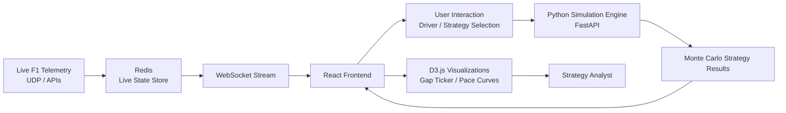

# F1 Race Intelligence & Strategy Engine

A high-fidelity Formula 1 race intelligence platform that models tyre degradation, fuel burn, pit loss, and safety car risk using deterministic physics and Monte Carlo simulation — visualized through real-time D3 dashboards.

This project replaces traditional betting-style prediction systems with an engineering-grade race strategy analysis workflow inspired by real F1 pit walls.

## What This Is

This platform answers a single question:

> “Given live race conditions, what strategy minimizes total race time while remaining robust to uncertainty?”

It does this by combining:
- Deterministic physics models (tyre wear, fuel burn, pit loss)
- Probabilistic Monte Carlo simulation (safety car, weather transitions)
- Real-time telemetry ingestion
- Interactive D3-based strategy visualization

There is **no betting, no odds, and no financial abstraction** — only race engineering.

## Core Concepts

### Deterministic Layer
Models physics-driven effects such as:
- Tyre degradation (compound-specific exponential decay)
- Fuel burn and mass reduction
- Pit stop time loss and traffic penalties

### Probabilistic Layer
Introduces uncertainty using Monte Carlo simulation:
- Safety car probability by lap window
- Weather transitions
- Strategy robustness under variance

### Visualization Layer
Transforms simulation output into intuitive engineering views:
- Live gap evolution
- Pace degradation curves
- Strategy risk vs reward maps

## System Architecture

## Feature Showcase

### 🔴 Live Gap Ticker (D3.js)
A real-time D3 visualization updating every ~60ms that shows:
- Relative gaps to the race leader
- Directional delta (closing / falling back)
- Smooth diff-based animation (no jitter)

**Color encoding:**
- Green → gap closing
- Red → gap increasing
- Neutral → stable

This acts as the primary entry point into deeper strategy analysis.

### 🧠 Deep Pull Architecture
Clicking a driver does not fetch static data. Instead, it:
1. Captures the live race snapshot
2. Routes the user into a contextual simulation view
3. Triggers on-demand Monte Carlo computation
4. Visualizes strategy outcomes dynamically

This mirrors real-world pit wall workflows: **observe → hypothesize → simulate → decide**.

## Technology Stack

### Frontend
- **React + TypeScript**: Core UI framework
- **Zustand**: Global state management
- **D3.js**: High-performance visualization
- **Framer Motion**: Micro-interactions

### Backend
- **FastAPI**: Simulation services
- **Python**: NumPy, Pandas for physics modeling
- **Redis**: Live telemetry state storage
- **WebSockets**: Real-time data streaming

### Design System
- Matte graphite base
- Carbon fiber texture accents
- Minimal neon (used only for deltas and alerts)

## About

This project was built as a personal exploration into race strategy engineering, inspired by Formula 1 telemetry systems and pit wall decision-making.

It prioritizes:
- Physics over heuristics
- Transparency over black-box AI
- Robustness over single-point predictions

The goal is not to predict outcomes — but to understand *why* strategies succeed or fail.
