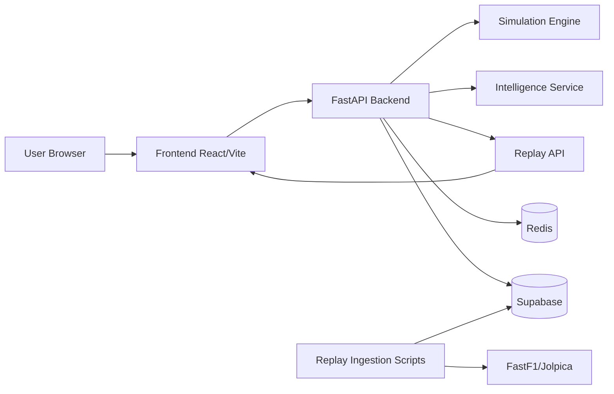

# F1-PREDICT

Simulation-first Formula 1 strategy platform with deterministic replay and inference-first intelligence workflows.

## Current Architecture

- Backend API: FastAPI (`version: 2.0.0`, `architecture: simulation-first`)
- Simulation Engine: deterministic + rigorous pipeline (`v3.0.0-engineering`)
- Intelligence Engine: bounded analytical mode (`v3.0.1-inference`)
- Replay Engine: frame-aligned telemetry playback from generated cache files

## Architecture Diagram


```mermaid
flowchart LR
    U[User Browser] --> FE[Frontend React/Vite]
    FE --> API[FastAPI Backend]
    API --> SIM[Simulation Engine]
    API --> INTEL[Intelligence Service]
    API --> REPLAY[Replay API]
    API --> REDIS[(Redis)]
    API --> SB[(Supabase)]
    SCRIPTS[Replay Ingestion Scripts] --> FF[FastF1/Jolpica]
    SCRIPTS --> SB
    REPLAY --> FE
```

## Core Pages

- `Simulation`: strategy controls and deterministic run outputs
- `Intelligence`: race briefing, priors, distributions, and robustness metrics
- `Replay`: ranked driver playback on normalized telemetry track maps
- `Schedule/Drivers/Teams/Results`: season context and static race metadata

## Data Principles

- No fabricated race telemetry in replay cache
- Replay ingestion enforces shared timeline alignment per driver
- Gold dataset artifacts are deterministic and checksum-frozen
- Calibration/validation scripts are part of governed workflow

## Setup

### Prerequisites

- Python 3.9+
- Node.js 18+

### Backend

```bash
cd backend
pip install -r requirements.txt
cp .env.example .env
uvicorn main:app --host 0.0.0.0 --port 8000
```

For local test parity with CI:

```bash
pip install -r backend/requirements-dev.txt
```

### Frontend

```bash
cd Frontend
npm install
npm run dev
```

## Docker (Local Full Stack)

This repo now includes:

- `backend/Dockerfile`
- `Frontend/Dockerfile`
- `docker-compose.yml`

### Prerequisites

- Docker Desktop (or Docker Engine + Compose plugin)
- A valid `backend/.env` file (Supabase credentials, etc.)

### Start all services

```bash
docker compose up --build
```

Services:

- Frontend: `http://localhost:5173`
- Backend: `http://localhost:8000`
- Backend health: `http://localhost:8000/health`
- Redis: `localhost:6379`

### Stop

```bash
docker compose down
```

### Notes

- Frontend runs Vite dev server inside container for parity with current workflow.
- Backend points to Redis container via `REDIS_HOST=redis`.
- Replay in production/cloud still requires telemetry files in Supabase `race-telemetry` bucket.

## Key Workflows

### Rigorous calibration and validation

```bash
npm run rigorous:calibrate
npm run rigorous:validate
```

### Concordance check

```bash
python backend/scripts/run_concordance.py --race-id 2024_1_bahrain --iterations 300 --runs 5
```

### Gold dataset

```bash
# Build one race
python backend/scripts/build_gold_dataset.py --season 2025 --round 1 --race Bahrain --slug bahrain

# Audit all races in v1
npm run gold:audit

# Freeze manifest/checksums for v1
npm run gold:freeze
```

### Replay telemetry ingestion

```bash
python backend/scripts/replay_ingestion.py --year 2024 --race Bahrain
python backend/scripts/generate_2025_data.py
```

## Documentation

- Architecture and project overview: `README.md`
- Architecture detail + diagram: `docs/architecture.md`
- API overview: `docs/api.md`
- Gold dataset specification: `docs/gold_dataset_spec.md`
- Rigorous governance: `docs/rigorous_governance.md`

Direct links:

- https://github.com/XVX-016/F1-PREDICT/blob/main/docs/architecture.md
- https://github.com/XVX-016/F1-PREDICT/blob/main/docs/api.md
- https://github.com/XVX-016/F1-PREDICT/blob/main/docs/gold_dataset_spec.md
- https://github.com/XVX-016/F1-PREDICT/blob/main/docs/rigorous_governance.md

## Known Limitations

- Replay availability depends on generated/uploaded telemetry cache per race.
- Some multi-car interaction effects are approximated.
- Intelligence mode is analytical and bounded; it is not an FIA live control system.
- When backend/data endpoints are unavailable, frontend enters demo/fallback behavior.

## Legal

Formula 1, F1, Grand Prix, and related marks are trademarks of Formula One Licensing B.V.
This project is independent and not affiliated with the FIA or any Formula 1 team.
