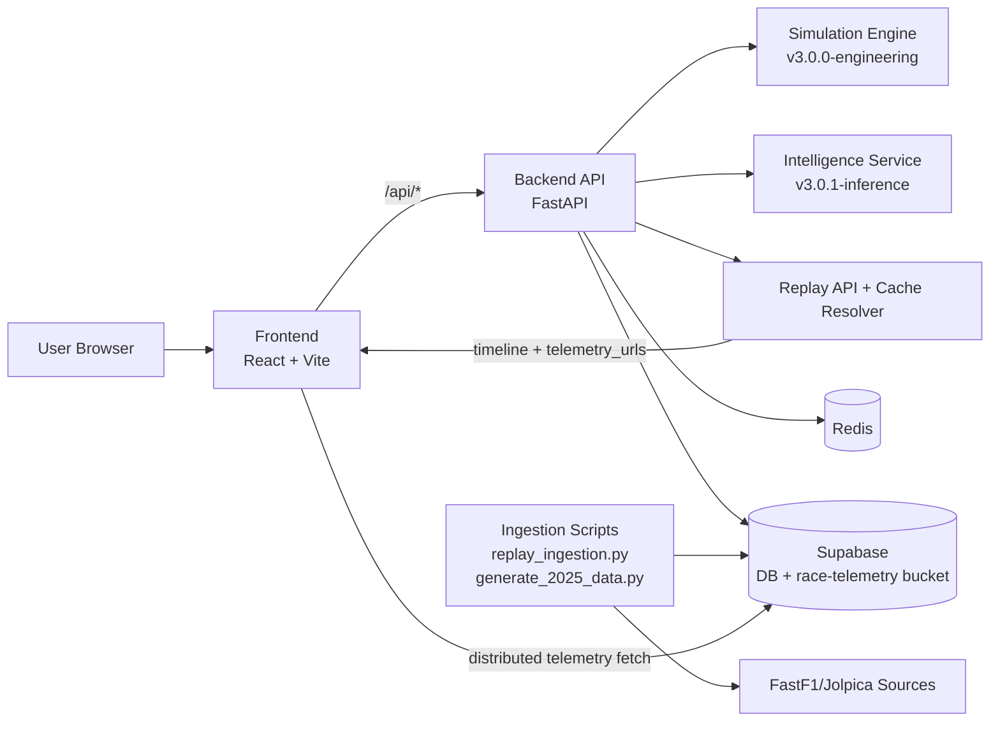

# F1-PREDICT Architecture

## Runtime Notes

- Backend `/health` reports `version: 2.0.0` and `architecture: simulation-first`.
- Replay uses a shared-timeline telemetry contract per driver.
- In cloud deployments, replay data should be served from Supabase storage when local cache is unavailable.
